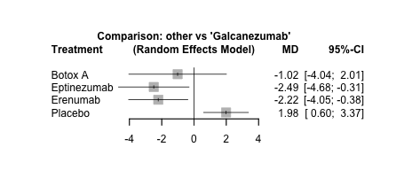

# Network Meta-Analysis of Chronic Migraine Preventives

## Objective

Compare the efficacy of **galcanezumab** against its key comparators in reducing
**monthly migraine days (MMD)** in patients with chronic migraine, and rank the
treatments using a network of direct and indirect evidence.

A network meta-analysis (NMA) lets us compare treatments that were never tested
head-to-head, by connecting them through common comparators (e.g. placebo) across
multiple studies.

## Approach

Implemented in R using the [`netmeta`](https://cran.r-project.org/package=netmeta)
package:

1. **Data prep** — load study-level treatment effects (mean difference in MMD and
   standard errors), screen for and drop missing values.
2. **Multi-arm handling** — the three-arm Crisp study is reshaped with
   `pairwise()` so its within-study correlation is handled correctly, then merged
   back into the contrast-level dataset.
3. **Network checks** — verify the evidence network is connected
   (`netconnection`) and free of duplicate contrasts before fitting.
4. **Model** — fit a random-effects NMA (`netmeta`, mean-difference summary
   measure) with placebo as the reference.
5. **Reporting** — network graph, treatment ranking (`netrank`), forest plot vs.
   galcanezumab, league table, and consistency diagnostics
   (`decomp.design`, `netsplit`).

## Files

| File | Purpose |
|---|---|
| [`NMA.R`](NMA.R) | Full analysis: data cleaning, network construction, model fit, plots, diagnostics |
| [`report/NMA_Meha_Patel.pdf`](report/NMA_Meha_Patel.pdf) | Written report of methods and findings |
| [`report/forest_plot.png`](report/forest_plot.png) | Forest plot of all treatments vs. galcanezumab |

## Results

From the forest plot (random-effects model, galcanezumab as reference),
galcanezumab demonstrated statistically significant superiority **only versus
placebo**. All active treatments achieved reductions exceeding the ~2-day
threshold generally considered clinically meaningful for chronic migraine
prevention, so the active agents were broadly comparable on this endpoint.

## Data

The analysis reads `data/Chronic_Migraine_Dataset.xlsx` (study, treatment, mean
difference `y`, standard error `se`). The dataset is compiled from published
clinical-trial results and is **not redistributed here**; place your copy in a
`data/` folder next to `NMA.R` to reproduce the analysis.

## Concepts

Evidence synthesis · indirect treatment comparison · random-effects models ·
multi-arm trials · network consistency / heterogeneity · forest plots · R
